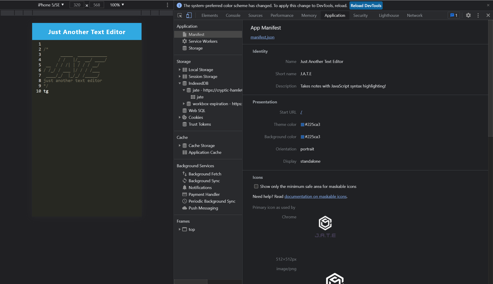

# Vals-PWA-Text-Editor
This is a single page text editor that runs in the browser. It will feature a number of data persistence techniques that serve as redundancy in case one of the options is not supported by the browser. The application will also function offline.
## Overview
this is an amazing and installable text editior that saves your inputs and leaves you in awe.
## Table of Contents


- [Introduction](#introduction)
- [Folders](#folders)
- [Getting Started](#getting-started)
- [Features](#features)
- [Deployment](#deployment)
- [Technologies Used](#technologies-used)
- [License](#license)

Introduction
This is a text editor web application designed to provide offline capabilities it utilizes modern web technologies such as Webpack, IndexedDB, and service workers to ensure efficient performance and reliability.

## Folders
The project is organized into a client-server architecture:
```
root
├── client
│   ├── src
│   │   ├── js
│   │   ├── css
│   │   └── index.html
│   ├── webpack.config.js
│   └── package.json
├── server
│   ├── routes
│   ├── controllers
│   ├── models
│   └── server.js
├── package.json
└── README.md
```
client/: Contains all front-end related code.
server/: Contains all back-end related code.
## Getting Started
Prerequisites
Node.js
npm
## Installation
Clone the repository:
### Install dependencies:
`npm install`
## example demonstration of how it should look




## Features

Client-Server Architecture: Organized folder structure separating client and server code.
Bundling with Webpack: JavaScript files are bundled using Webpack.
Generated Assets: Webpack plugins generate an HTML file, service worker, and a manifest file.
Next-Gen JavaScript: The application supports and runs seamlessly with modern JavaScript features.
IndexedDB Integration: Automatically creates a database for storage when the editor is opened.
Auto-save Feature: Content is saved to IndexedDB when you click off the DOM window.
Persistent Storage: Retrieves content from IndexedDB when the editor is reopened.
PWA Installation: Allows downloading the web application as a desktop icon.
Service Worker: Registers a service worker using Workbox for offline capabilities.
Caching: Static assets and pages are pre-cached upon loading.

## Deployment

Render Link:coming soon

Github Repository: coming soon

## Technologies Used

Node.js: JavaScript runtime for server-side code.
Express: Web framework for Node.js.
Webpack: Module bundler for JavaScript.
IndexedDB: NoSQL database for client-side storage.
Workbox: Service worker libraries for offline caching.

## License

This project is licensed under the MIT License. See the LICENSE file for more details.


